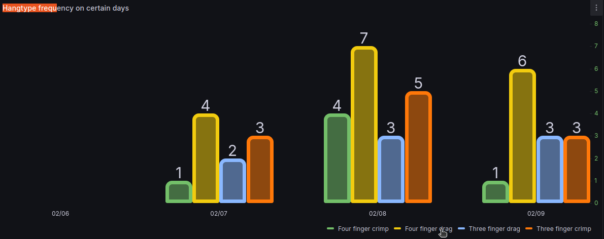

#  Hangboard Training Tracker 

## 🔥 Overview  
Take your climbing training to the next level with a **smart Hangboard Training Tracker**! This ESP32-powered system logs your training sessions, tracks progress, and visualizes data in **real-time** using **Grafana, Node-RED, and InfluxDB** on a Raspberry Pi.

The dashboard can help with keeping track of your training.



🎯 **Key Features:**  
✅ **Real-time Tracking** – Logs your training sessions instantly  
✅ **MQTT Communication** – Seamless data transfer to the backend  
✅ **Interrupt-Based Button Handling** – Ensures smooth and fast response  
✅ **Data Visualization** – Track your progress with powerful charts  
✅ **Lightweight & Efficient** – Runs on ESP32 with minimal power consumption  

---

## 🛠️ Tech Stack  
| Component  | Technology Used |
|------------|----------------|
| **Microcontroller** | ESP32 + ESP-IDF |
| **Communication** | MQTT |
| **Backend** | Node-RED, InfluxDB |
| **Visualization** | Grafana |
| **Hardware** | Buttons with pull-up resistors, LEDs, Buzzer |

---

## ⚡ Getting Started  
### 🔌 Hardware Setup  
1️. Connect **four buttons** to ESP32 with pull-up resistors.  
2️. Ensure ESP32 is powered and connected to Wi-Fi, you will have to add your password and network.  
3. Setup NodeRed, the InfluxDb database and the grafana dashboard on your rasberry PI.


### 🖥️ Software Setup  
🚀 **Flash ESP32**:  
```sh
idf.py build flash monitor